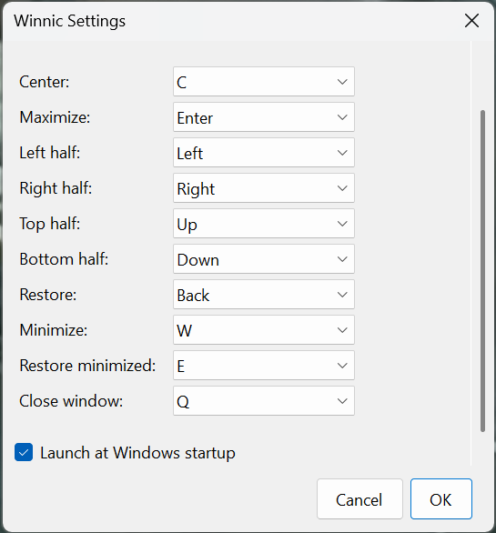

# Winnic


Small Windows application (WinForms, .NET 9) that lives in the system tray and helps you manage the current active window:
- center the active window within the monitor's work area;
- maximize the active window to full screen;
- restore the previous position/size of the active window;
- snap the active window to left/right halves and top/bottom halves;
- configure hotkeys and autostart via the Settings window.

## Features

- Center active window: default `Ctrl + Alt + C`.
- Maximize active window: default `Ctrl + Alt + Enter`.
- Restore last position of active window: default `Ctrl + Alt + Backspace`.
- Snap to left half: default `Ctrl + Alt + Left`.
- Snap to right half: default `Ctrl + Alt + Right`.
- Snap to top half: default `Ctrl + Alt + Up`.
- Snap to bottom half: default `Ctrl + Alt + Down`.
- Tray icon with menu: "Settings…" and "Exit".
- Autostart on sign-in (toggle in settings).

## Architecture and structure

- `Program.cs` — entry point, starts the tray context.
- `TrayApplicationContext.cs` — tray icon logic, context menu, hotkey handling, applying settings and autostart.
- `WindowService.cs` (`WindowCenterService`) — operations on the active window: centering, maximize, snapping to halves, saving/restoring placement (WinAPI: `user32.dll`).
- `HotkeyManager.cs` — global hotkey registration/unregistration (WinAPI `RegisterHotKey`), callback dispatching.
- `SettingsForm.cs` — settings window: choose modifiers and keys for actions, autostart flag.
- `SettingsService.cs` — read/write settings to `%LocalAppData%/Winnic/settings.json` (System.Text.Json).
- `Settings.cs` — settings model `AppSettings` (stores hotkeys and autostart flag).
- `AutoStartService.cs` — enable/disable autostart via `HKCU\Software\Microsoft\Windows\CurrentVersion\Run`.
- `IconFactory.cs` — generate a simple app icon on the fly.
- `Winnic.csproj` — .NET 9 Windows Forms project, `app.manifest` — application manifest.

Notes:
- Windows-only (uses WinAPI and Windows Forms).
- Requires permissions to register global hotkeys (standard user is usually enough).
- On first launch creates `%LocalAppData%/Winnic` and `settings.json`.

## Requirements

Environment and SDK:
- **.NET SDK 9.0** (Windows) with `net9.0-windows` and Windows Forms.
- **Windows 10/11** OS. WSL/Linux is not supported for running (cross-building is not supported either) because the target is WinExe with WinAPI.

NuGet packages: no external packages are used; standard .NET library and P/Invoke to `user32.dll` are used.

## Build and run locally

1. Install .NET SDK 9.0 on Windows.
2. Open the project folder in the command line:
   ```bash
   cd path\to\winnic
   ```
3. Restore (optional) and build Release:
   ```bash
   dotnet build -c Release
   ```
4. Run the app:
   ```bash
   dotnet run -c Release
   ```

Alternatively, publish a self-contained build:
```bash
dotnet publish -c Release -r win-x64 --self-contained true /p:PublishSingleFile=true
```
The executable will be in `bin/Release/net9.0-windows/win-x64/publish/`.

## Configure hotkeys

Open the tray icon menu → "Settings…" and set hotkeys for:
- Center window
- Maximize window
- Restore previous position
- Snap to left/right halves
- Snap to top/bottom halves

By default, `Alt` is always included among common modifiers. If a hotkey registration fails due to a conflict, the app will show a balloon notification.

## Autostart

The "Autostart" option controls the registry key at `HKCU/Software/Microsoft/Windows/CurrentVersion/Run`. When enabled, it writes the path to the current executable there.

## Developer notes

- Hotkey registration: `HotkeyManager.Register` throws if it fails (e.g. the combination is taken). Handlers show a balloon with the error text.
- Centering and monitor handling: uses `MonitorFromWindow`/`GetMonitorInfo` with a fallback to `Screen.FromHandle`.
- Placement restore: stores `WINDOWPLACEMENT` of the active window, then applies it via `SetWindowPlacement` with a fallback to `ShowWindow(SW_SHOWNORMAL)`.
- Settings are serialized to JSON with `JsonStringEnumConverter` for `System.Windows.Forms.Keys`.

## Known limitations

- Interaction with UWP/protected windows may be limited.
- Apps run as Administrator may require elevated rights for hotkeys to work properly.
- Not intended for multi-window snapping scenarios on a single hotkey; operates only on the current active window.

## License

MIT License. See LICENSE.txt for the full text.


